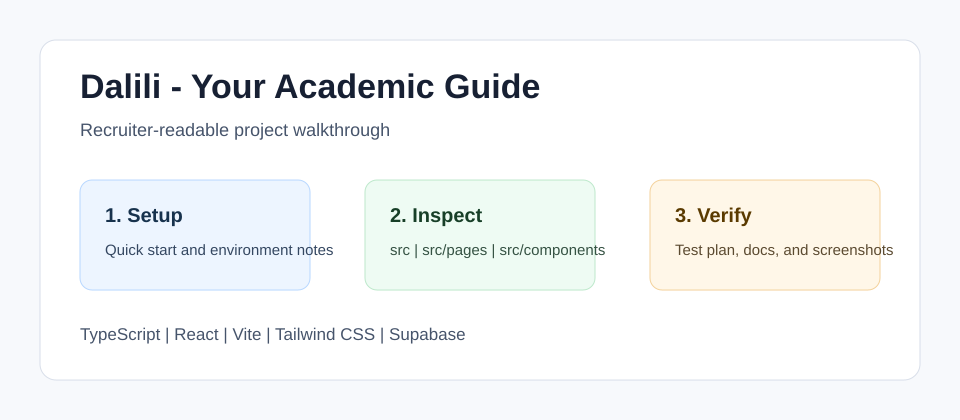

<!-- bettergithub:generated-readme -->
# Dalili - Your Academic Guide

Dalili helps students plan academic work by combining course tracking, goals, GPA planning, study sessions, and support workflows in one React application. It is useful for recruiters because it shows a full product surface: authentication, Supabase-backed data, reusable UI components, calendar-style planning, and student-centered flows that turn raw academic information into actions.

## Tech Stack

- TypeScript
- React
- Vite
- Tailwind CSS
- Supabase
- Vitest

## Quick Start

```bash
npm install
npm run dev
npm test
```

## Usage

- Open the local Vite URL.
- Review the course, goals, GPA, tutor, activity, and profile pages.
- Use the Supabase migration files as the database history for the product model.

## Environment Variables

Create a .env file only when connecting to a real Supabase project. The codebase can still be inspected and tested locally without committing API keys.

## Demo and Screenshots



The diagram above is a lightweight walkthrough image for GitHub reviewers. It shows the reviewer path, the implementation areas to inspect, and the evidence this repository provides. For non-web course projects, this replaces a live demo with reproducible local setup and manual verification notes.

## Testing and Quality

Testing is documented even when the original assignment uses manual verification instead of a full automated suite.

```bash
npm test
```

See [docs/test-plan.md](docs/test-plan.md) for the manual or automated checks that should be used before presenting this repository.

## Repository Structure

- `src`
- `src/pages`
- `src/components`
- `src/hooks`
- `supabase/migrations`

## Architecture Notes

The app is organized as a Vite React client with page-level routes, reusable shadcn-style UI components, hooks for academic domain data, and Supabase migrations for persistence. The current polish pass does not change application code; it documents setup, test expectations, and reviewer flow.

See [docs/architecture.md](docs/architecture.md) for a more detailed reviewer map.

## Recruiter Notes

- The README opens with the project purpose, audience, and result so the repository is scannable.
- Setup, environment, usage, testing, and architecture notes are collected in predictable sections.
- Existing source code was not changed by the documentation polish pass.

## Roadmap

- Add a short result screenshot or terminal capture after the project is rerun locally.
- Add one small automated smoke test if the course/tooling environment makes it practical.
- Keep the README aligned with the latest verified run command.

## Existing Project Notes

# Welcome to My Lovable project

## Project info

**URL**: https://daliliapp.lovable.app

## Can I sign in?
Yes You Can!! Click on the link attached above and sign in to my online app.
You will get a confirmation email and then you can sign in!

## What technologies are used for this project?

This project is built with:

- Vite
- TypeScript
- React
- shadcn-ui
- Tailwind CSS

